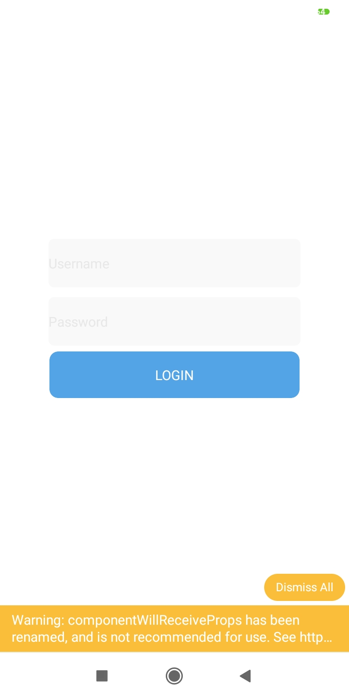
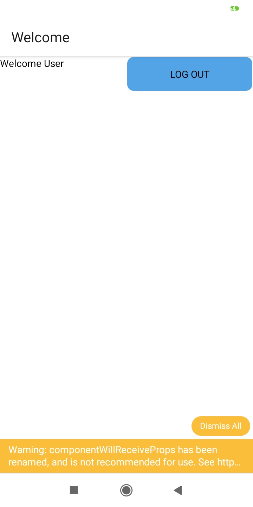
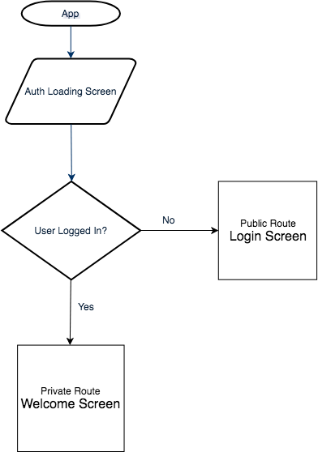

<h1 align="center">
	
</h1>

<h3 align="center">
  React Native Login flow pattern
</h3>

<h1 align="center">
	
</h1>

- react-native
- react-navigation
- react-native-app
- authentication
- login 

1. A partir da raiz do projeto, entre na pasta do frontend web rodando `cd frontend`;
2. Rode `npm install` para instalar as dependências;

Open the `App.js` file to start writing some code. You can preview the changes directly on your phone or tablet by clicking the **Run** button or use the simulator by clicking **Tap to Play**. When you're done, click **Save** and share the link!

# Usei Expo
`expo r -c`

# comando para executar react
```sh
react-native run-android
react-native start
```
<h1 align="center">
	
</h1>


- https://reactnavigation.org/docs/getting-started/

- Renato Lucena
- @cpdrenato
